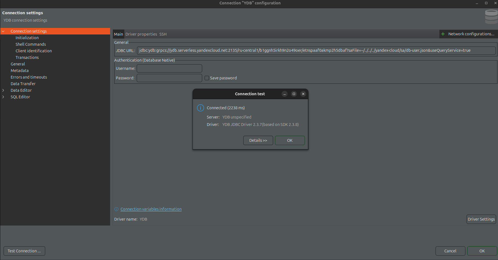

# Кейс приложение ухода за растениями

## Полезные материалы

- Swagger
1) [Сервис api](https://api.hackcentrifuge.ru/api/docs)
2) [Сервис моделей машинного обучения](https://api.hackcentrifuge.ru/ai/docs)
- Подлючение к YDB

Для подлючения к YDB (Yandex DataBase) с **Dbeaver** нужно:

Выполнить все как в [Туториале](https://ydb.tech/docs/ru/integrations/gui/dbeaver) и на моменте создания подключения в поле ввода JDBC URL, укажите следующую строку соединения:

**jdbc:ydb:grpcs://ydb.serverless.yandexcloud.net:2135/ru-central1/b1ggnh5irkh9n2o49oer/etnspaaf0akmp2h5dbaf?saFile=<Место до вашего файла>&useQueryService=true**

Изменить в строке соединения параметр **saFile** на путь до [db-user.json](docs/db-user.json) он нужен для аутентификации и saFile нужно писать через тильду (почему-то у меня только через тильду получилось), таким образом saFile=~/<Путь до вашего файла с этой директории>

**Пример:**

В поля username и password вводить ничего не нужно, пропускайте их.
